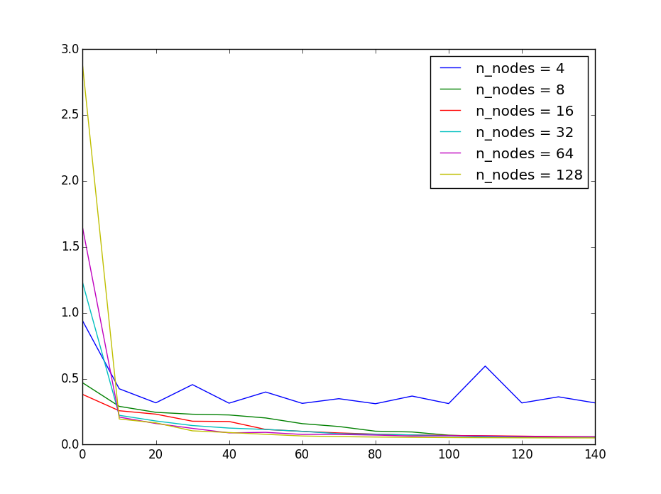
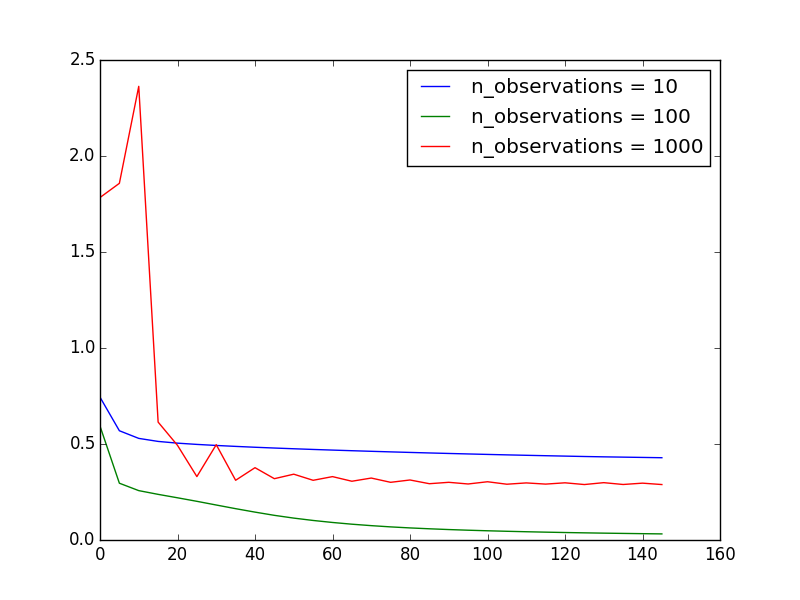
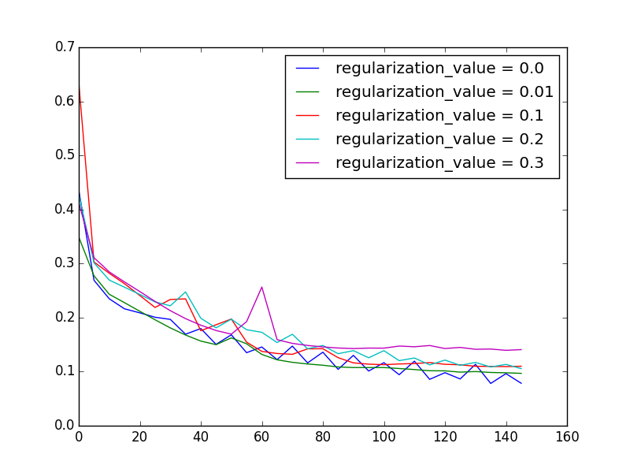
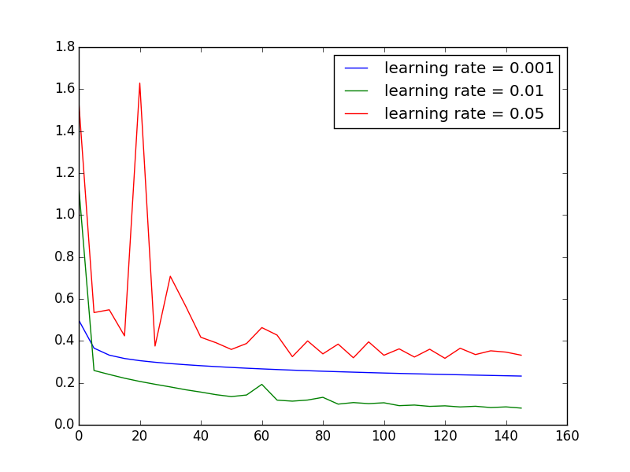

# NumPy Neural Network
#### This is a simple multilayer perceptron implemented from scratch in pure Python and NumPy.

This repo includes a three and four layer nueral network (with one and two hidden layers respectively), trained via batch gradient descent with backpropogation. The tunable parameters include:
* learning rate
* regularization lambda
* nodes per hidden layer
* number of output classes
* stopping criterion
* activation function

A good starting point for this model is a learning rate of 0.01, regularization of 0.01, 32 nodes per hidden layer, and ReLU activations. These will, of course, differ according the context in which the model is used. 

parameter tuning looked as follows:

As you can see, most of the patterns worked as expected. More data led to more stable training, more nodes led to a better model fit, increased regularization led to increased training loss, and a smaller learning rate caused a smoother but slower-moving training curve. Worth noting, however, is how extreme values of some of these values caused the model to become less stable. A high number of observations or learning rate, for example, caused erratic and sub-optimal behaviour during training. This is an indication that there is still a significant that can be done in order to optimize this model. 

### lessons learned:
* logistic activation functions really do complicate MLP training. Too low of a learning rate, too many observations, and sigmoidal activation functions all made this model highly unstable, and even broke it in some cases.

* These these models  are incredibly flexible. This simple network was able to approximate every function I threw its way.

* neural networks are hard. I have a newfound appreciation for the layers of abstraction that tensorflow, keras, etc. provide between programmer and network.

Thank you to [WildML](http://www.wildml.com/2015/09/implementing-a-neural-network-from-scratch/) for providing a starting point for this project + code, and to Ian Goodfellow's book *Deep Learning* for background on the algorithms and parameter tuning.